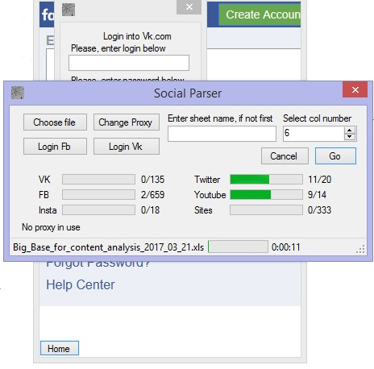

<h2>Views-scraper</h2>
Program that scraps data about posts views count from:
<ul>
<li>Facbook</li>
<li>Twitter</li>
<li>Instagram</li>
<li>Youtube</li>
<li>VK</li>
<li>News sites (estimates from SimilarWeb.com)</li>
</ul>

Takes as input xls file where search column that contains hrefs. 
There is ability to connect through proxy servers, just add file with them into main directory. 

Before using you must set necsecary information about programs that use Twitter, facebook, vk and youtube API into config file.

